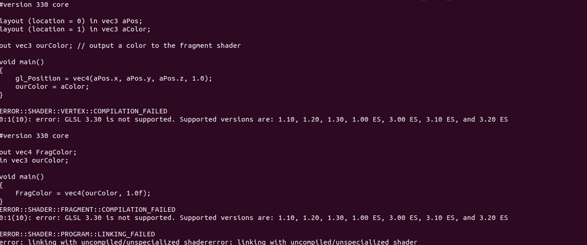

# Curso de introdução a computação gráfica: OpenGL Moderno

> Esta seção descreve o desenvolvimento da segunda atividade do curso, que tem como objetivo familiarizar o aluno com a estrutura de um programa de OpenGl moderno.

## Instalando o OpenGL Moderno

Para realizar a atividade, primeiramente, foi necessário instalar o OpenGL. Para isso, foi seguido um tutorial no [wikibooks](https://en.wikibooks.org/wiki/OpenGL_Programming/Installation/Linux) sobre como instalar o OpenGL moderno no Linux, que se resume a executar os seguintes comandos no terminal:

``` bash
sudo apt-get install build-essential libgl1-mesa-dev  # OpenGL
sudo apt-get install libglew-dev libsdl2-dev libsdl2-image-dev libglm-dev libfreetype6-dev  # Bibliotecas necessárias
```

## Compilação do OpenGL Antigo

Após a instalação, foi compilado o programa baseado no OpenGL antigo. Ao rodar o comando make na pasta, foi gerado um executável e o resultado se encontra na imagem a seguir.


## Compilação do OpenGL Moderno

Após o sucesso obtido na compilação do OpenGL antigo, foi compilado o programa baseado no OpenGL moderno. Ao rodar o comando make na pasta e executar o executável gerado, ocorreu o seguinte erro:



Que ocasionou no seguinte resultado:


Para resolver o problema, foi realizado uma busca no google. A solução foi encontrada em uma resposta do [stackoverflow](https://stackoverflow.com/questions/52592309/0110-error-glsl-3-30-is-not-supported-ubuntu-18-04-c), que se baseia em executar o seguinte comando no terminal:

``` bash
export MESA_GL_VERSION_OVERRIDE=3.3
```

Ao executar o programa novamente, foi obtido o seguinte resultado:


## Conclusão

Com a compilação do progama baseado em OpenGL Moderno realizada com sucesso, o objetivo desta atividade foi alcançado, sendo possível realizar trabalhos utilizando esta tecnologia daqui parafrente.

## Referências

**Instalação do OpenGL Moderno:** 
https://en.wikibooks.org/wiki/OpenGL_Programming/Installation/Linux

**Solução para o erro no Stackoverflow:** 
https://stackoverflow.com/questions/52592309/0110-error-glsl-3-30-is-not-supported-ubuntu-18-04-c