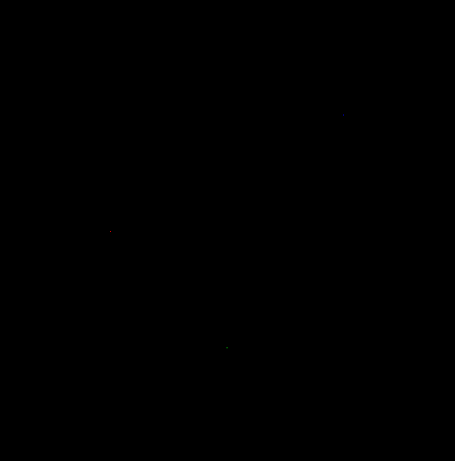
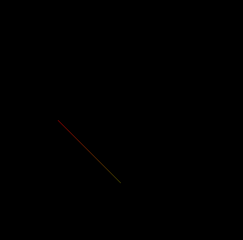
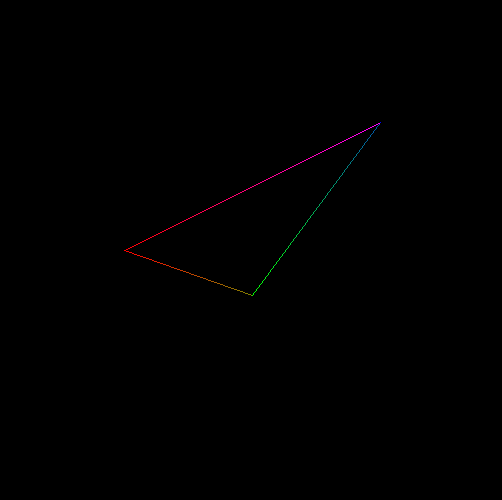

# Curso de introdução a computação gráfica: Rastering

> Esta seção descreve o desenvolvimento da primeira atividade do curso, que tem como objetivo familiarizar o aluno com algoritmos de rasterização utilizados computação gráfica.

## Atividade 1: Rasterizando um ponto na memória de vídeo'



A imagem acima representa um monitor, dentro dele foram desenhados três pixels, um vermelho, um verde e um azul.

Cada pixel foi desenhado a partir da chamada da função _PutPixel()_, onde recebe como parâmetro, uma struct que contêm as informações das coordenadas e da cor do pixel. A struct em questão está descrita abaixo.

```c
struct pixel
{
int x;
int y;
int red;
int green;
int blue;
int alpha;
};

```

Como cada pixel está escrito em memória, é necessário resolver a seguinte operação matemática para localizar a posição na tela, onde p0 é a struct recebida pela função, p0.x linha desejada, p0.y a coluna desejada e _IMAGE_WIDTH_ a largura da tela em pixels.:

```c
4 * p0.x + 4 * p0.y * IMAGE_WIDTH + 0

```

## Atividade 2: Rasterizando uma linha na tela



Na representação do monitor acima, está desenhada uma linha utilizando algoritmo de _Bresenham_ com um degradé criado a partir da progressão linear da cor de seu pixel inicial até o final.

Para implementar a progressão linear, foi obtido a taxa de variação da cor em relação a iteração do algoritmo. Como sabemos os valores iniciais e finais de cada pixel da linha (vermelho, verde, azul e alpha) e a quantidade de iterações necessárias para realizar o algoritmo, basta realizar a seguinte operação:

```C
int dRed = (p1.red - p0.red) / inc;
```

Onde dRed é a taxa de variação do vermelho em relação a iteração do algorítimo, p1.red o valor inicial do vermelho, p0.red o valor final do vermelho e inc a quantidade de iterações do algoritmo.

## Atividade 3: Rasterizar um triângulo na tela



Na representação do monitor acima, foi rasterizada um triângulo não preenchido a partir da criação de três linhas com progressão linear de cor.

Com a linha desenhada pelo algoritmo de _Bresenham_ só conseguimos desenhar em um quadrante, então foram necessárias algumas modificações para que consigamos desenhar em todos os quadrantes.

As duas primeiras modificações realizadas foram suficientes para que tornar possível desenhar em quatro dos 8 quadrantes. A primeira foi realizar um swap dos dois vértices de uma aresta, caso o **X** da aresta final seja menor que o da aresta inicial da linha, mudando o vertice inicial e final da linha. A segunda alteração foi adicionar uma variável de iteração para o **Y**, caso este cresça negativamente, a variável irá decrementar, caso contrário ela irá incrementar seu valor durante as iterações do algoritmo de _Bresenham_.

Porém, estas modificações não foram suficientes para realizar a rasterização da linha em todos os octantes, faltando a metade, que são os octantes complementares aos 4 que são possíveis rasterizar até então.

Para conseguir desenhar neles, foi necessário realizar uma inversão das variáveis do algoritmo. Na implementação original, as operações estão dispostas a seguir:

``` C
   int dx = p1.x - p0.x;
   int dy = (p1.y - p0.y) * inc_y;
   int d = 2 * dy - dx;
   int inc_e = 2 * dy;
   int inc_ne = 2 * (dy - dx);

   for (int i = 0; i < inc; i++)
   {

       p0.x += inc_x;

       if (d <= 0)
       {
           d += inc_e;
       }
       else
       {
           d += inc_ne;
           p0.y += inc_y;
       }

       PutPixel(p0);
   }
```

Já a implementação da função com as variáveis invertidas estão dispostas abaixo:

``` C
   int dx = p1.x - p0.x;
   int dy = (p1.y - p0.y) * inc_y;
   int d = 2 * dx - dy;
   int inc_e = 2 * dx;
   int inc_ne = 2 * (dx - dy);

   for (int i = 0; i < inc; i++)
   {

       p0.y += inc_y;

       if (d <= 0)
       {
           d += inc_e;
       }
       else
       {
           d += inc_ne;
           p0.x += inc_x;
       }

       PutPixel(p0);
   }
```

Onde a variável inc_x e inc_y presentes no cálculo do delta de X e de Y respectivamente, estão presentes para manter o valor do delta absoluto. E a função PutPixel() desenha o pixel na tela em memória. Pode-se perceber comparando ambos os códigos que a inversão se trata basicamente de substituir dx por dy, e vice versa, e inverter a incrementação em X e Y.
