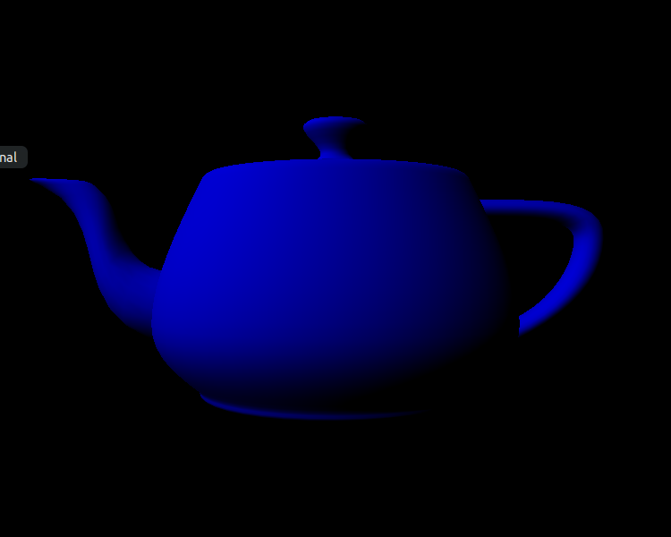

# Curso de introdução a computação gráfica: Shading

> O objetivo deste trabalho é familiarizar os alunos com os modelos de iluminação tradicionalmente utilizados na rasterização: ambiente, difuso e especular (ou Phong). Para isto, os alunos implementarãoos três modelos utilizando o vertex shader do OpenGL.

## Compilação e Execução do Código

Como o C++ não aceita declarações implicitas, é necessário realizar a instalação do GLEW, que cria as referências para todas as extenções do OpenGl. Para sua instalação, foi seguido o guia de instalação no site do [GLEW](http://glew.sourceforge.net/).

Após satisfazer todas as dependências, foi compilado o código deste projeto utilizando o MAKE, que tem descrito o seguinte comando:

``` bash
g++ -Wall -Wextra -Wpedantic -std=c++17 -O0 -g3 -DDEBUG main.cpp -lglut -lGLEW -lGLU -lGL -o shading_gl
```

Ao executar o executável gerado, a seguinte tela com um *teapot*, apareceu:


## Modelo difuso

Para adicionaro modelo de reflexão difuso, primeiramente é necessário calcular o valor de dois vetores, o vetor normal N e o vetor que aponta em direção a fonte de luz L:

``` c++
    vec3 L = normalize(I_p_pos - (model_mat * vec4(obj_spc_vertex_pos, 1.0)).xyz);
    vec3 N = normalize(mat3(transpose(inverse(model_mat))) * obj_spc_N);
```

Após isto, estes vetores foram utilizados no modelo de iluminação: 

``` c++
    I = I_a * k_a + I_p * k_d * dot(L, N);
```

Sendo o resultado obtido:



## Modelo especular

Para adicionaro modelo de reflexão especular, foi necessário calcular o valor de outros dois vetores, o vetor de reflexão R e o vetor que aponta em direção a câmera de luz V:

``` c++
    vec3 R = -reflect (L, N);
    vec3 V = normalize(cam_pos - (model_mat * vec4(obj_spc_vertex_pos, 1.0)).xyz);
```

Após isto, foi necessário atualizar o modelo de reflexão: 

``` c++
    I = I_a * k_a + I_p * (k_d * dot(L, N) + k_s * pow(dot(R, V), 64)); 
```

Porêm o resultado obtido não foi o esperado, ocorrendo a reflexão da luz em regiões indesejadas:


Porém, ao se utilizar a função max(), o problema foi corrigido:

``` c++
    I = I_a * k_a + I_p * (k_d * max(dot(L, N), 0.0f) + k_s * pow(max(dot(R, V), 0.0f), 64));
```


## Conclusão

Nesta atividade foram obtidos vários conehcimentos. O primeiro é a cerca das bibliotecas utilizadas na computação gráfica, ao se observar o código disponibilizado pelo professor. O segundo é como as estruturas e cálculos mencionados em sala são utilizados na prática.

## Referências

**GLEW:** 
http://glew.sourceforge.net/

**Slides do professor** 