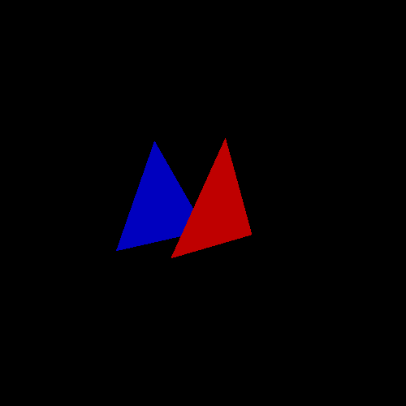

# Curso de introdução a computação gráfica: Transformações

> O objetivo deste trabalho é familiarizar os alunos com a estrutura do pipeline gráfico
> através da implementação das transformações geométricas que o compõem.

## Compilação e Execução do Código

Como o C++ não aceita declarações implícitas, é necessário realizar a instalação do GLEW, que cria as referências para todas as extensões do OpenGl. Para sua instalação, foi seguido o guia de instalação no site do [GLEW](http://glew.sourceforge.net/).

Após satisfazer todas as dependências, foi compilado o código deste projeto utilizando o MAKE, que tem descrito o seguinte comando:

``` bash
g++ -Wall -Wextra -Wpedantic -std=c++17 -O0 -g3 -DDEBUG main.cpp -lglut -lGLEW -lGLU -lGL -o transform gl
```

Ao executar o executável gerado, a seguinte tela com dois triângulos, um sobrepondo o outro, apareceu:


## Transformações

A atividade proposta nesta seção diz respeito a modificar as três matrizes presentes no projeto para realizar transformações nos triângulos. Essas transformações alteram vários aspectos da imagem, como serão demonstrados a seguir.

### Escala

A primeira transformação realizada foi a escala. A escala é utilizada para redimensionar o tamanho das imagens. Reduzir ou aumentar a escala por um mesmo fator em todos os eixos causa seu aumento ou diminuição, caso sejam utilizados fatores diferentes, ocorre a distorção da imagem. Veja a seguir os mesmos triângulos apresentados anteriormente, porém modificados por uma escala de fator `(x, y, z) = (1/3, 3/2, 1)`:


As alterações necessárias no código para se realizar a atividade estão descritas a seguir:

``` cpp

float model_array[16] = {0.3f, 0.0f, 0.0f, 0.0f,
                             0.0f, 1.5f, 0.0f, 0.0f,
                             0.0f, 0.0f, 1.0f, 0.0f,
                             0.0f, 0.0f, 0.0f, 1.0f};
    glm::mat4 model_mat = glm::make_mat4(model_array);

```

### Translação

A segunda transformação realizada foi a translação. A translação é utilizada para mover uma imagem na tela. Ela mantém a mesma escala da imagem, mas mudando sua posição em relação a imagem original no espaço. Veja a seguir os mesmos triângulos demonstrados na primeira imagem mas transladados por um fator de `(x, y, z) = (1, 0, 0)`:


As alterações necessárias no código para se realizar a atividade estão descritas a seguir:

``` cpp

float model_array[16] = {1.0f, 0.0f, 0.0f, 0.0f,
                             0.0f, 1.0f, 0.0f, 0.0f,
                             0.0f, 0.0f, 1.0f, 0.0f,
                             1.0f, 0.0f, 0.0f, 1.0f};
    glm::mat4 model_mat = glm::make_mat4(model_array);

```

### Projeção perspectiva

A terceira transformação realizada foi a perspectiva. A perspectiva é utilizada para passar a impressão de profundidade. Ao se distanciar de alguns objetos, eles apresentam comportamentos diferentes de acordo com a posição de cada um do observador, e a perspectiva trata disso.  Veja a seguir a primeira imagem dos dois triângulos com um fator de perspectiva `d = 1/2`, onde d é a distância até o centro da imagem;


As alterações necessárias no código para se realizar a atividade estão descritas a seguir:

``` cpp

    float proj_array[16] = {1.0f, 0.0f, 0.0f, 0.0f,
                            0.0f, 1.0f, 0.0f, 0.0f,
                            0.0f, 0.0f, 1.0f, -2.0f,
                            0.0f, 0.0f, 0.5f, 1.0f};

    glm::mat4 proj_mat = glm::make_mat4(proj_array);

```

### Posição da câmera

A quarta transformação realizada foi a posição da câmera. A posição da câmera diz respeito a posição no espaço na qual o objeto está sendo observado. Para isso é necessário levar em consideração alguns fatores, pois a posição da câmera diz respeito a sua posição no espaço e seu ângulo de rotação em torno de sí mesmo, além de ser necessário um ponto de referência para se realizar isto.  Portanto, são necessários setar três valores para se realizar a atividade proposta:

```
Posição da Câmera = (-1/10, 1/10, 1/4)
Vetor Up da câmera = (0, 1, 0)
Ponto que a câmera aponta = (0, 0, 0)
```

O seguinte código demonstra o procedimento necessário para se realizar as operações matemáticas descritas durantes as aulas e mencionadas na descrição da atividade para se realizar a atividade:

``` cpp
    glm::vec3 cameraUp = glm::vec3(0.0f, 1.0f, 0.0f);
    glm::vec3 cameraPos = glm::vec3(-0.1f, 0.1f, 0.25f);
    glm::vec3 cameraTarget = glm::vec3(0.0f, 0.0f, 0.0f);

    glm::vec3 cameraZ = -glm::normalize(cameraTarget - cameraPos);
    glm::vec3 cameraX = glm::normalize(glm::cross(cameraUp, cameraZ));
    glm::vec3 cameraY = glm::normalize(glm::cross(cameraZ, cameraX));

    glm::mat4 matrizT = glm::mat4(glm::vec4(1, 0, 0, 0),
                            glm::vec4(0, 1, 0, 0),
                            glm::vec4(0, 0, 1, 0),
                            glm::vec4(-cameraPos.x, -cameraPos.y, -cameraPos.z, 1));

    glm::mat4 matrizB = glm::mat4(glm::vec4(cameraX.x, cameraY.x, cameraZ.x, 0),
                            glm::vec4(cameraX.y, cameraY.y, cameraZ.y, 0),
                            glm::vec4(cameraX.z, cameraY.z, cameraZ.z, 0),
                            glm::vec4(0, 0, 0, 1));

    view_mat = matrizB * matrizT;
```



### Transformação livre

Esta não se trata de uma transformação, mas de um espaço disponibilizado para documentar mudanças realizadas livremente nas estruturas de dados utilizadas para manipular os triângulos. Foi realizado então todas as transformações descritas nas seções anteriores. Escala por um fator de `(x, y, z) = (1/3, 3/2, 1)`, translação por um fator de `(x, y, z) = (1, 0, 0)`, pespectiva com um `d = 1/2` e a mudança na posição da câmera. O resultado está demonstrado na imagem a seguir.


## Conclusão

Nesta atividade foram obtidos vários conhecimentos. O primeiro é a cerca das bibliotecas utilizadas na computação gráfica, ao se observar o código disponibilizado pelo professor. O segundo é como as estruturas e cálculos mencionados em sala são utilizados na prática.

## Referências

**GLEW:** 
http://glew.sourceforge.net/

**Slides do professor** 
